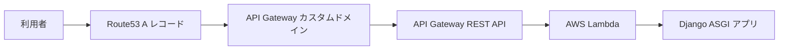
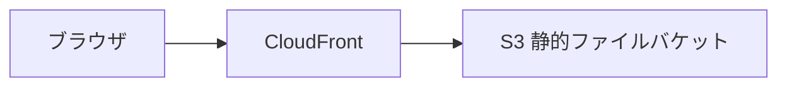

# アーキテクチャ

## 全体構成

ServerlessPortfolio は Django アプリケーションを AWS Lambda 上で実行します。Lambda の公開入口は API Gateway REST API です。本番用のカスタムドメイン `serverless.portfolio.cobaemon.com` と staging 用のカスタムドメイン `staging.serverless.portfolio.cobaemon.com` は API Gateway の Regional カスタムドメインとして定義されます。

静的ファイルは Django アプリケーションから直接配信せず、S3 バケットと CloudFront ディストリビューションで配信する構成です。

## リクエスト経路

## 静的ファイル経路

## AWS リソース

### `template.yaml`

- `DjangoFunction`: Django アプリケーションを実行する Lambda 関数。
- `DjangoApi`: API Gateway REST API。
- `ServerlessCertificate`: API Gateway カスタムドメイン用 ACM 証明書。
- `ApiGatewayCustomDomain`: `DomainName` パラメータで指定される API Gateway カスタムドメイン。
- `ApiGatewayBasePathMapping`: カスタムドメインを API Gateway のステージへ割り当てるマッピング。
- `ApiGatewayRecordSet`: Route53 A レコード。
- `StaticFilesResponseHeadersPolicy`: 静的ファイル配信用 CloudFront のレスポンスヘッダーポリシー。
- `CloudFrontDistribution`: S3 静的ファイルバケットをオリジンにする CloudFront ディストリビューション。

### `dependencies.yaml`

- `StaticFilesBucket`: `cobaemon-serverless-portfolio-${Env}-static` の S3 バケット。
- `CloudFrontOriginAccessControl`: CloudFront から S3 へ署名付きでアクセスする OAC。
- `OACId` と `StaticFilesBucketName` の CloudFormation Export。

### `bucketpolicy.yaml`

`template.yaml` の `CloudFrontDistributionId` Export を参照し、静的ファイルバケットに対象 CloudFront Distribution からの `s3:GetObject` だけを許可します。

## Lambda と Django

`asgi_lambda.py` は `config.asgi.application` を Mangum でラップし、`handler` として公開します。`template.yaml` の Lambda Handler は `asgi_lambda.handler` です。

## 環境

SAM テンプレートの `Env` パラメータは `staging` と `prod` を許容します。`EnvMapping` は `staging` を `config.settings.staging`、`prod` を `config.settings.prod` に対応させています。

## 関連ファイル

- [`template.yaml`](../template.yaml)
- [`dependencies.yaml`](../dependencies.yaml)
- [`bucketpolicy.yaml`](../bucketpolicy.yaml)
- [`asgi_lambda.py`](../asgi_lambda.py)
- [`config/asgi.py`](../config/asgi.py)
- [`config/settings/prod.py`](../config/settings/prod.py)
- [`config/settings/staging.py`](../config/settings/staging.py)
- [`config/settings/dev.py`](../config/settings/dev.py)
