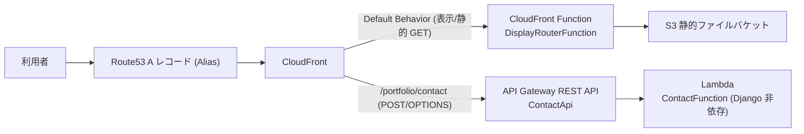

# アーキテクチャ

## 全体構成

公開入口は CloudFront ディストリビューション（`template.yaml` の `CloudFrontDistribution`）です。カスタムドメイン `serverless.portfolio.cobaemon.com`（staging は `staging.serverless.portfolio.cobaemon.com`）の Route53 A レコードは CloudFront の別名（Alias）を指します（出典: `template.yaml` の `ApiGatewayRecordSet`（`AliasTarget.DNSName: !GetAtt CloudFrontDistribution.DomainName`）、`aws route53 list-resource-record-sets --hosted-zone-id Z00462201BTRUWFZ0YO7V` の実測結果を記録した [`development-records/unused-resource-removal-django-retirement.md`](development-records/unused-resource-removal-django-retirement.md) 第 8.4 節）。

表示ページは Lambda を経由せず、S3 + CloudFront（OAC 経由）から静的配信します。7 言語分の表示ページはビルド時に事前レンダリングされ、S3 へ同期されます（出典: `buildspec.yml` の `python manage.py render_static` と `aws s3 sync staticfiles/ s3://${BUCKET_NAME}/ --delete`、`portfolio/management/commands/render_static.py`）。

動的処理は問い合わせ送信（`POST /portfolio/contact`）のみで、CloudFront の当該 Behavior が API Gateway REST API `ContactApi` をオリジンとして呼び出し、Django に依存しない Lambda `ContactFunction` が処理します（出典: `template.yaml` の `CloudFrontDistribution.DistributionConfig.CacheBehaviors`（`PathPattern: /portfolio/contact`）、`ContactApi`、`ContactFunction`）。

API Gateway のカスタムドメイン（`ApiGatewayCustomDomain`）、そのベースパスマッピング、REGIONAL の ACM 証明書（`ServerlessCertificate`）、および Django 実行用 Lambda（`DjangoFunction`）と API Gateway REST API（`DjangoApi`）は退役し、`template.yaml` から除去済みです（出典: [`development-records/unused-resource-removal-django-retirement.md`](development-records/unused-resource-removal-django-retirement.md) 第 1.1・8.2・8.3 節、`tests/iac/test_template_policies.py` の `RetiredDisplayPathAbsenceTests`）。

## リクエスト経路


```mermaid
flowchart LR
    User["利用者"]
    Route53["Route53 A レコード (Alias)"]
    CloudFront["CloudFront"]
    Router["CloudFront Function<br/>DisplayRouterFunction"]
    S3["S3 静的ファイルバケット"]
    ContactApi["API Gateway REST API<br/>ContactApi"]
    ContactFunction["Lambda<br/>ContactFunction (Django 非依存)"]

    User --> Route53 --> CloudFront
    CloudFront -->|"Default Behavior (表示/静的 GET)"| Router --> S3
    CloudFront -->|"/portfolio/contact (POST/OPTIONS)"| ContactApi --> ContactFunction
```

`DisplayRouterFunction`（viewer-request）は `Accept-Language` を交渉して `/` および `/portfolio/top/` を `/<lang>/portfolio/top/index.html` へ内部書き換えし、末尾が `/` の URI へ `index.html` を補完します。対応言語は `ja, en, fr, es, ru, zh-hans, ar`、既定は `ja` です（出典: `template.yaml` の `DisplayRouterFunction.FunctionCode`、`config/settings/base.py` の `LANGUAGES`）。

全 Behavior は `ViewerProtocolPolicy: redirect-to-https` により HTTPS を強制します（出典: `template.yaml` の `DefaultCacheBehavior` および `CacheBehaviors`）。

## AWS リソース

### `template.yaml`

- `ContactApi`: 問い合わせ用 API Gateway REST API。`StageName` は `Env` パラメータと同じ値で、`MethodSettings` により全リソース・全メソッドへスロットリング（`ThrottlingRateLimit: 5`、`ThrottlingBurstLimit: 10`）を適用します。
- `ContactFunction`: 問い合わせ送信を処理する Lambda。`Handler: contact_function.handler.lambda_handler`、`Runtime: python3.12`、`CodeUri: ./`。イベントは `POST /portfolio/contact` と `OPTIONS /portfolio/contact` のみです。実行ロールは `AWSLambdaBasicExecutionRole` に加え、`ses:SendEmail`（検証済み identity ARN と Configuration Set ARN にリソース限定）と `ssm:GetParameter`（3 パラメータに限定）のみを持ちます。
- `ContactFunctionLogGroup`: `/aws/lambda/${ContactFunction}` のロググループ。`RetentionInDays: 365`、`DeletionPolicy: Delete`。
- `DisplayRouterFunction`: 表示 URL の言語ルーティングと `index.html` 補完を行う CloudFront Function（viewer-request）。
- `DisplayResponseHeadersPolicy`: 表示（S3 Default Behavior）レスポンス用のヘッダポリシー。セキュリティヘッダ（CSP/HSTS/X-Content-Type-Options/X-Frame-Options/Referrer-Policy）と静的ファイル用 CORS を統合したもの（旧 `StaticFilesResponseHeadersPolicy` を統合・置換）。CSP 値は `ContentSecurityPolicy` パラメータから供給され、ビルドが生成した `'sha256-...'` を含むハッシュベース CSP（nonce なし）を注入します（出典: `buildspec.yml` の `parameters.json` 生成段、`portfolio/management/commands/render_static.py` の `content_security_policy`）。
- `CloudFrontDistribution`: S3 静的オリジン（表示/静的、Default Behavior）と `ContactApi` オリジン（`/portfolio/contact`）の複数オリジンを持つ CloudFront ディストリビューション。`CloudFrontCertificateArn` パラメータが非空のときのみ `Aliases` と us-east-1 の ACM 証明書を有効化します。
- `ApiGatewayRecordSet`: カスタムドメインの Route53 A レコード（Alias 先は CloudFront）。論理 ID は同名レコードの削除・再作成による公開断を避けるため退役前の名称を維持しています。作成条件は `CreateCloudFrontARecord`（`ExistingARecord=false` かつ CloudFront 証明書 ARN 指定済み）です。
- `AcmValidationRecordSet`: us-east-1（CloudFront 用）ACM 証明書の DNS 検証 CNAME（TTL 300）。名前・値はハードコードせず `buildspec.yml` が `acm:DescribeCertificate` から取得して供給します。
- `Outputs.CloudFrontDistributionId`: `bucketpolicy.yaml` が参照する CloudFront Distribution ID の Export。

WAF（`WAFWebACL` / `WAFWebACLAssociation`）は既定不採用としてコメントアウトのまま保持しています（出典: `template.yaml` の該当コメントブロック）。

### `dependencies.yaml`

- `StaticFilesBucket`: `cobaemon-serverless-portfolio-${Env}-static` の S3 バケット。
- `CloudFrontOriginAccessControl`: CloudFront から S3 へ署名付きでアクセスする OAC。
- `OACId` と `StaticFilesBucketName` の CloudFormation Export。

### `bucketpolicy.yaml`

`template.yaml` の `CloudFrontDistributionId` Export を参照し、静的ファイルバケットに対象 CloudFront Distribution からの `s3:GetObject` だけを許可します。

## Django コードの位置付け

Django（`config` / `portfolio`）は、ビルド時の静的化（`collectstatic` と `render_static`）および設定検証（`python manage.py check --fail-level WARNING`）で使用します。実行時に Django を実行する Lambda は存在しません（出典: `buildspec.yml`、`template.yaml` に `DjangoFunction` の宣言なし）。

`config.asgi.application` を Mangum でラップして `handler` を公開していたモジュール `asgi_lambda.py` は、git 追跡下から除去済みです（出典: `git ls-files -- asgi_lambda.py` の一致 0 件）。依存していた `mangum` も Dependency_Manifest から除去済みです（出典: `git grep -n -E "^mangum==" -- requirements.txt` の一致 0 件）。現行の Lambda エントリーポイントは `contact_function.handler.lambda_handler` のみです（出典: `template.yaml:174` の `ContactFunction.Handler`。`Runtime: python3.12`（`template.yaml:175`）、`CodeUri: ./`（`template.yaml:176`））。

Django 表示経路向けコード（`portfolio/views.py:11` の `Top`、`portfolio/views.py:54-55` の `contact`）は、ビルド時の静的化に必要であるため保持しています（出典: `buildspec.yml:238` の `python manage.py render_static` 実行、`portfolio/management/commands/render_static.py`）。

## 環境

SAM テンプレートの `Env` パラメータは `staging` と `prod` を許容します。Django 設定モジュールの切り替えは `buildspec.yml` の `pre_build` 段で `ENV` に応じて `DJANGO_SETTINGS_MODULE` を `config.settings.staging` / `config.settings.prod` に設定して行います（`template.yaml` の `Mappings.EnvMapping` は `DjangoFunction` 退役に伴い除去済み。出典: `buildspec.yml` の該当 `case` 分岐、[`development-records/unused-resource-removal-django-retirement.md`](development-records/unused-resource-removal-django-retirement.md) 第 1.1 節）。

## 確認コマンド

```powershell
aws cloudformation describe-stack-resources --stack-name cobaemon-serverless-portfolio-stack --region ap-northeast-1 --profile aws_portfolio_profile
aws cloudfront get-distribution-config --id E3QK078NBPDKHO --profile aws_portfolio_profile
aws apigateway get-rest-apis --region ap-northeast-1 --profile aws_portfolio_profile
```

## 関連ファイル

- [`template.yaml`](../template.yaml)
- [`dependencies.yaml`](../dependencies.yaml)
- [`bucketpolicy.yaml`](../bucketpolicy.yaml)
- [`buildspec.yml`](../buildspec.yml)
- [`contact_function/handler.py`](../contact_function/handler.py)
- [`portfolio/management/commands/render_static.py`](../portfolio/management/commands/render_static.py)
- [`config/settings/prod.py`](../config/settings/prod.py)
- [`config/settings/staging.py`](../config/settings/staging.py)
- [`config/settings/dev.py`](../config/settings/dev.py)
